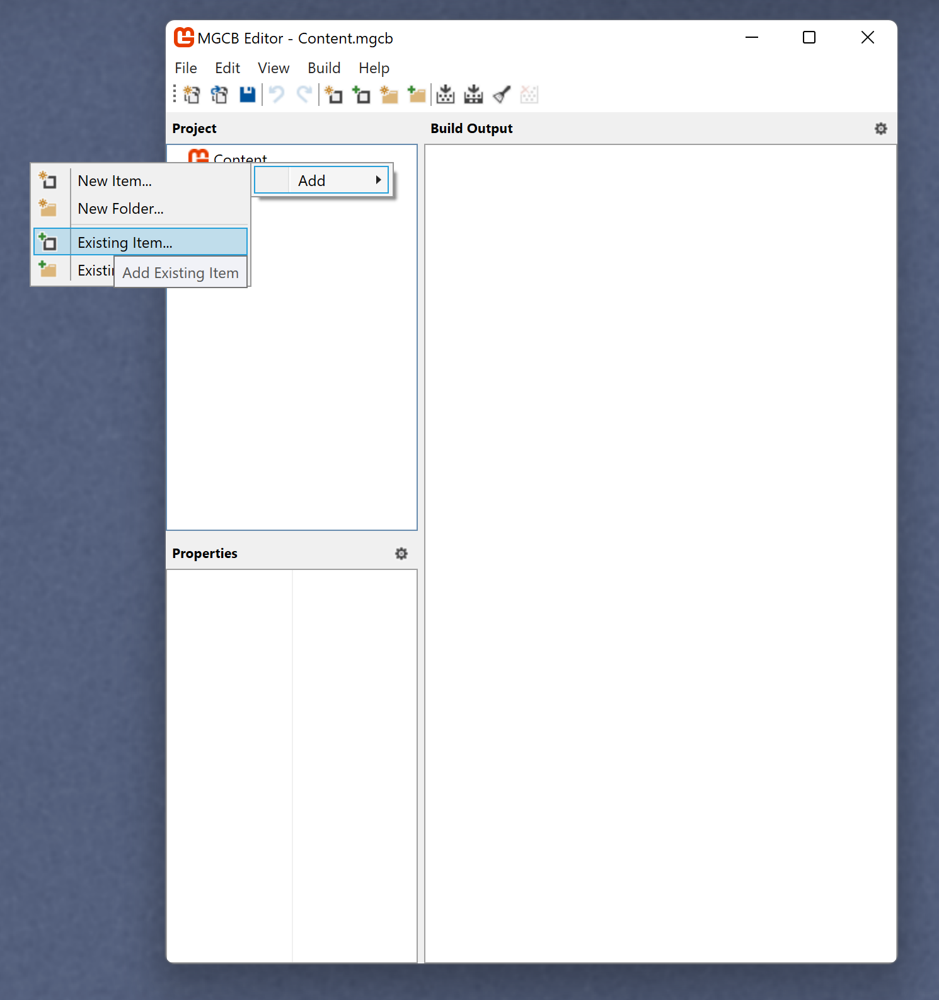
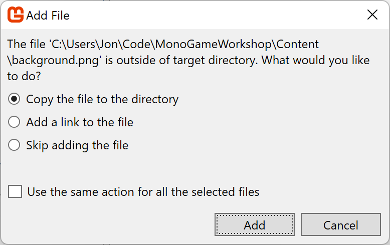

## Getting Started

1. Install the MonoGame templates. Run the command `dotnet new --install MonoGame.Templates.CSharp`.
1. Install the MonoGame content tool. Run the command `dotnet tool install -g dotnet-mgcb-editor`.
1. Register the MonoGame content tool. Run the command `mgcb-editor --register`. If the `mgcb-editor` command can't be found, it may be because the dotnet global tools directory isn't in your path. The mgcb-editor tool should get installed in the `~/.dotnet/tools` directory. You may need to run it using a fully qualified path.
1. Create a new MonoGame project. Run the command `dotnet new mgdesktopgl -o PathWhereYouWantYourProjectToBeCreated`. Alternatively, you can manually create the directory where you want you project to go, then `cd` to that directory and run the command `dotnet new mgdesktopgl`.
1. Add the Aether.Physics2D package to your project. When in the directory where your project is located, run the command `dotnet add package Aether.Physics2D.MG`.
1. Make sure your project compiles and runs. Run the command `dotnet run` when in your project directory. Your program should launch as a MonoGame window with a blue background.

## Adding Content

Let's add some content for our game to use. Content includes things like images, fonts, 3D models, and sounds. For our game, we'll just add some images for now.

MonoGame likes to use a content pipeline to pre-process most of the content you're going to use in your game. This pipeline puts the content in a format that faster and easier for MonoGame to work with.

In your project directory, there should be a subdirectory named `Content`. Inside that directory there should be a file named `Content.mgcb`. Open it with `mgcb-editor`. You can open `mgcb-editor` directly, then open `Content.mgcb` from the UI. Or if `mgcb-editor` got properly associated with `.mgcb` files during the registration process then you can just double click on `Content.mgcb` and it will open correctly. Use whichever method works best for you.

We're going to add three images as content. Start by downloading the following three images.
* [Player image](Content/player.png)
* [Platform image](Content/platform.png)
* [Background image](Content/background.png)

These images all come from [opengameart.org](https://opengameart.org). You can find the originals [here](https://opengameart.org/content/background-12), [here](https://opengameart.org/content/grass-platforms), and [here](https://opengameart.org/content/2d-knight-chibi).

To actually add the images, right click on the "Content" node, then select "Add", then "Existing Item". It should look something like this:



Browse to where you downloaded the image files. You can select all three images at once, or add them one at a time. When prompted, choose to copy the files to the directory. This will make a copy in your project's Content directory.



After adding the images, *make sure to save `Content.mgcb`*. After saving, do a `dotnet build` in your project directory, just to make sure the images got added correctly.

## Loading Content

Go to the `Game1` class in your project code. Add three class level variables.

```csharp
private Texture2D playerTexture;
private Texture2D platformTexture;
private Texture2D backgroundTexture;
```

Add some code to the `LoadContent` method to initialize those three variables. Your `LoadContent` method should look something like this:

```csharp
protected override void LoadContent()
{
    _spriteBatch = new SpriteBatch(GraphicsDevice);

    playerTexture = Content.Load<Texture2D>("player");
    platformTexture = Content.Load<Texture2D>("platform");
    backgroundTexture = Content.Load<Texture2D>("background");
}
```

## Drawing the Background

Let's add some code to draw the background. In the `Game1` class, modify the `Draw` method. It should look something like this:

```csharp
protected override void Draw(GameTime gameTime)
{
    GraphicsDevice.Clear(Color.CornflowerBlue);

    _spriteBatch.Begin();
    _spriteBatch.Draw(backgroundTexture, 
        new Rectangle(0, 0, GraphicsDevice.Viewport.Width, GraphicsDevice.Viewport.Height), 
        null, Color.White);
    _spriteBatch.End();

    base.Draw(gameTime);
}
```

When we draw an image, it has to be done as part of a sprite batch. Calling `_spriteBatch.Begin()` creates a new sprite batch. Calling `_spriteBatch.End()` tells MonoGame that the current sprite batch is finished.