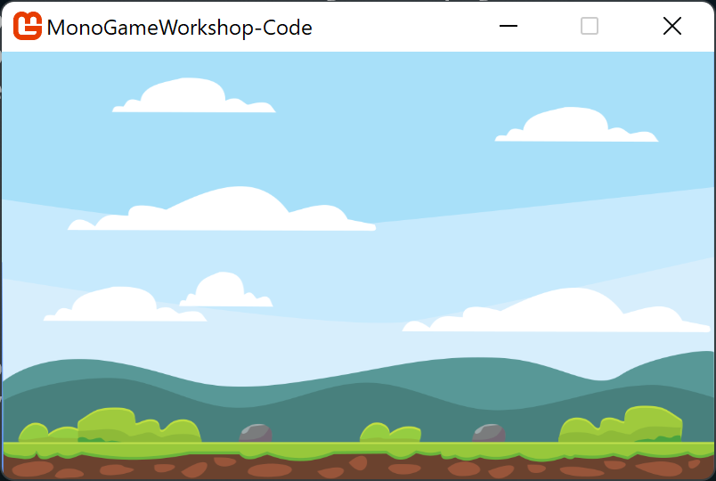
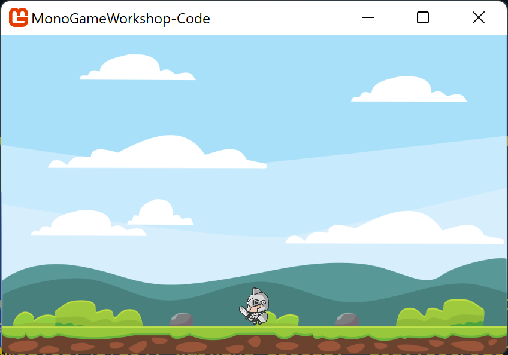
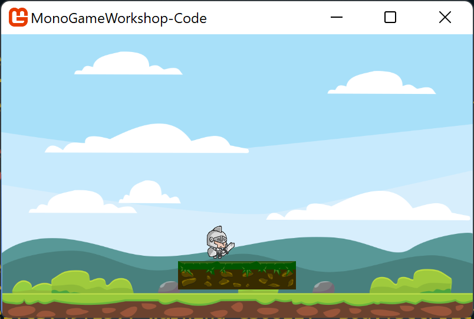

This is a guide to help you get started with MonoGame and Aether.Physics2D.

## Prerequisites

This guide was tested with both .NET 6 and .NET Core 3.1 installed, but the project templates target .NET Core 3.1. You'll either need .NET Core 3.1 installed, or you'll need to change the project file created to target .NET 6 instead of .NET Core 3.1.

You'll need a way to edit code. I'd recommend Visual Studio Code, but any text/code editor should work.

This guide definitely works on Windows. It should work on Mac and Linux, but some things might need to be tweaked.

You can see the completed code [here](https://github.com/theparticleman/MonoGameWorkshop-Code).


## Getting Started

1. Install the MonoGame templates. Run the command `dotnet new --install MonoGame.Templates.CSharp`. This only needs to be done once.
1. Install the MonoGame content tool. Run the command `dotnet tool install -g dotnet-mgcb-editor`. This only needs to be done once.
1. Register the MonoGame content tool. Run the command `mgcb-editor --register`. This only needs to be done once. If the `mgcb-editor` command can't be found, it may be because the dotnet global tools directory isn't in your path. The mgcb-editor tool should get installed in the `~/.dotnet/tools` directory. You may need to run it using a fully qualified path.
1. Create a new MonoGame project. Run the command `dotnet new mgdesktopgl -o PathWhereYouWantYourProjectToBeCreated`. Alternatively, you can manually create the directory where you want your project to go, then `cd` to that directory and run the command `dotnet new mgdesktopgl`.
1. Add the Aether.Physics2D package to your project. When in the directory where your project is located, run the command `dotnet add package Aether.Physics2D.MG`.
1. Add the MonoGame.Extended package to your project. When in the directory where your project is location, run the command `dotnet add package MonoGame.Extended`.
1. Make sure your project compiles and runs. Run the command `dotnet run` when in your project directory. Your program should launch as a MonoGame window with a blue background.

## Adding Content

Let's add some content for our game to use. Content includes things like images, fonts, 3D models, and sounds. For our game, we'll just add some images for now.

MonoGame likes to use a content pipeline to pre-process most of the content you're going to use in your game. This pipeline puts the content in a format that faster and easier for MonoGame to work with.

In your project directory, there should be a subdirectory named `Content`. Inside that directory there should be a file named `Content.mgcb`. Open it with `mgcb-editor`. You can open `mgcb-editor` directly, then open `Content.mgcb` from the UI. Or if `mgcb-editor` got properly associated with `.mgcb` files during the registration process then you can just double click on `Content.mgcb` and it will open correctly. Use whichever method works best for you.

We're going to add three images as content. Start by downloading the following three images.
* [Player image](Content/player.png)
* [Platform image](Content/platform.png)
* [Background image](Content/background.png)

These images all come from [opengameart.org](https://opengameart.org). You can find the originals [here](https://opengameart.org/content/background-12), [here](https://opengameart.org/content/grass-platforms), and [here](https://opengameart.org/content/2d-knight-chibi).

To actually add the images, right click on the "Content" node, then select "Add", then "Existing Item". It should look something like this:


Browse to where you downloaded the image files. You can select all three images at once, or add them one at a time. When prompted, choose to copy the files to the directory. This will make a copy in your project's Content directory.


After adding the images, *make sure to save `Content.mgcb`*. After saving, do a `dotnet build` in your project directory, just to make sure the images got added correctly.

## Loading Content

Go to the `Game1` class in your project code. Add three class level variables.

```csharp
private Texture2D playerTexture;
private Texture2D platformTexture;
private Texture2D backgroundTexture;
```

Add some code to the `LoadContent` method to initialize those three variables. Your `LoadContent` method should look something like this:

```csharp
protected override void LoadContent()
{
    _spriteBatch = new SpriteBatch(GraphicsDevice);

    playerTexture = Content.Load<Texture2D>("player");
    platformTexture = Content.Load<Texture2D>("platform");
    backgroundTexture = Content.Load<Texture2D>("background");
}
```

## Drawing the Background

Let's add some code to draw the background. In the `Game1` class, modify the `Draw` method. It should look something like this:

```csharp
protected override void Draw(GameTime gameTime)
{
    GraphicsDevice.Clear(Color.CornflowerBlue);

    _spriteBatch.Begin();
    _spriteBatch.Draw(backgroundTexture, 
        new Rectangle(0, 0, GraphicsDevice.Viewport.Width, GraphicsDevice.Viewport.Height), 
        null, Color.White);
    _spriteBatch.End();

    base.Draw(gameTime);
}
```

When we draw an image, it has to be done as part of a sprite batch. Calling `_spriteBatch.Begin()` creates a new sprite batch. Calling `_spriteBatch.End()` tells MonoGame that the current sprite batch is finished.

After adding this code, run your game again. The background image should get drawn like this:



## Resize the Window

Let's make our game window resizable.

In the constructor of your `Game1` class, add some code to make the game window resizable. The code is `Windows.AllowUserResizing = true;`. Your constructor should look like this:

```csharp
public Game1()
{
    _graphics = new GraphicsDeviceManager(this);
    Content.RootDirectory = "Content";
    IsMouseVisible = true;
    Window.AllowUserResizing = true;
}
```

If you run your game again, you should be able to resize the window, including being able to maximize the window.

## Add a Camera

We could just draw the rest of the images for our game directly, like we're doing with the background. But if we did that we'd have to worry about scaling the images based on the size of the window. We can set up a camera to take care of that for us.

Add another class level variable to your `Game1` class.

```csharp
private OrthographicCamera camera;
```

The `OrthographicCamera` class comes from the `MonoGame.Extended` package. You will need to add a `using MonoGame.Extended;` statement to the top of your `Game1` class to use it. There are other types of cameras, but this type will work for us.

Also add two class level constants.

```csharp
private const int width = 200;
private const int height = 120;
```

These values will be the size of our virtual world.

In the `Initialize` method of your `Game1` class, add some code to set up the camera. After adding the code, your `Initialize` method should look like this:

```csharp
protected override void Initialize()
{
    var viewportAdapter = new ScalingViewportAdapter(GraphicsDevice, width, height);
    camera = new OrthographicCamera(viewportAdapter);

    base.Initialize();
}
```

You'll need to add a `using MonoGame.Extended.ViewportAdapters;` to your `Game1` class in order to use the `ScalingViewportAdapter` class.

If you want to, you can build and/or run your game again at this point to make sure everything is working, but you won't see any changes yet.

## Add Some Physics

We'll use the Aether.Physics2D package to handle physics for us. Specifically, we're going to use the version of the package built for MonoGame (which is why we added a reference to `Aether.Physics2D.MG`). Aether is based on Farseer, which in turn is based on Box2D. Sometimes this can be useful to know when looking for documentation.

In your `Game1` class, add a class level variable.

```csharp
private World world;
```

You'll need to add a `using tainicom.Aether.Physics2D.Dynamics;` statement to use the `World` class.

In your constructor, initialize the `world` variable.

```csharp
world = new World();
```

Let's also set up the gravity in our world.

```csharp
world.Gravity = new Vector2(0, 300);
```

Your constructor should look like this:

```csharp
public Game1()
{
    _graphics = new GraphicsDeviceManager(this);
    Content.RootDirectory = "Content";
    IsMouseVisible = true;
    Window.AllowUserResizing = true;
    world = new World();
    world.Gravity = new Vector2(0, 300);
}
```

We also need to update the world as our game in running. In the `Update` method add the following code:

```csharp
world.Step((float)gameTime.ElapsedGameTime.TotalSeconds);
```

Your entire `Update` method should look something like this:

```csharp
protected override void Update(GameTime gameTime)
{
    world.Step((float)gameTime.ElapsedGameTime.TotalSeconds);

    if (GamePad.GetState(PlayerIndex.One).Buttons.Back == ButtonState.Pressed || Keyboard.GetState().IsKeyDown(Keys.Escape))
        Exit();

    base.Update(gameTime);
}
```

## Show the Player

Now that we have a world with basic physics set up, let's add a player to our world.

Add three more class level variables to your `Game1` class.

```csharp
private Body playerBody;
private Vector2 playerPosition = new Vector2(width * 0.5f, height * 0.3f);
private Vector2 playerSize = new Vector2(width  * 0.06f, height * 0.12f);
```

The `playerBody` variable will be the physical shape of the player. The position will be where the player starts. And the size will be how big to make the player. We could make the position and size specific values if we wanted. But then if we changed the size of our virtual world and wanted the position and size to stay the same relative to the world size, we would have to change the values. For this game we want the player to always stay the same relative size, regardless of the world size. But this won't be true for every game.

In your `Initialize` method, add some code to set up the `playerBody`.

```csharp
playerBody = world.CreateBody(playerPosition, 0, BodyType.Dynamic);
var fixture = playerBody.CreateRectangle(playerSize.X, playerSize.Y, 1f, Vector2.Zero);
fixture.Restitution = 0.1f;
fixture.Friction = 0.5f;
```

The first line creates the player body and adds it to the world. The second line adds a rectanglar physical shape to the body. A body can have multiple fixtures, but in this case a single rectangular fixture is sufficient. Setting the restitution sets how much the rectangle bounces. Setting the friction sets how quickly the rectangle slows down when moving along something else.

Your complete `Initialize` method should like this this:

```csharp
protected override void Initialize()
{
    var viewportAdapter = new ScalingViewportAdapter(GraphicsDevice, width, height);
    camera = new OrthographicCamera(viewportAdapter);

    playerBody = world.CreateBody(playerPosition, 0, BodyType.Dynamic);
    var fixture = playerBody.CreateRectangle(playerSize.X, playerSize.Y, 1f, Vector2.Zero);
    fixture.Restitution = 0.1f;
    fixture.Friction = 0.5f;

    base.Initialize();
}
```

We need to add some code to draw the player. We'll create a new sprite batch to do the rest of our drawing. We need a new sprite batch so we can use information from our camera to draw things in a scale-independent way.

We also need to calculate where exactly to draw the player. We'll use the `playerBody` we created, as well as the `playerSize` we created.

```csharp
_spriteBatch.Begin(transformMatrix: camera.GetViewMatrix());

var playerDestination = new Rectangle((int)(playerBody.Position.X - playerSize.X / 2),
    (int)(playerBody.Position.Y - (playerSize.Y / 2)), (int)playerSize.X, (int)playerSize.Y);
_spriteBatch.Draw(playerTexture, playerDestination,
    null, Color.White, 0, Vector2.Zero, SpriteEffects.None, 0);

_spriteBatch.End();
```

Your entire `Draw` method should look something like this:

```csharp
protected override void Draw(GameTime gameTime)
{
    GraphicsDevice.Clear(Color.CornflowerBlue);

    _spriteBatch.Begin();
    _spriteBatch.Draw(backgroundTexture,
        new Rectangle(0, 0, GraphicsDevice.Viewport.Width, GraphicsDevice.Viewport.Height),
        null, Color.White);
    _spriteBatch.End();

    _spriteBatch.Begin(transformMatrix: camera.GetViewMatrix());

    var playerDestination = new Rectangle((int)(playerBody.Position.X - playerSize.X / 2),
        (int)(playerBody.Position.Y - (playerSize.Y / 2)), (int)playerSize.X, (int)playerSize.Y);
    _spriteBatch.Draw(playerTexture, playerDestination,
        null, Color.White, 0, Vector2.Zero, SpriteEffects.None, 0);

    _spriteBatch.End();

    base.Draw(gameTime);
}
```

If you run your game, you should see the player on the screen now. Unfortunately, the player will quickly fall off the bottom of the screen. Let's fix that in the next section.

## Add Some Edges

Currently our game doesn't have any way to keep the player on the screen. In your `Initialize` code, add the following code:

```csharp
var bottomEdge = world.CreateEdge(new Vector2(0, height * 0.92f), new Vector2(width, height * 0.92f));
bottomEdge.SetRestitution(0.01f);
bottomEdge.SetFriction(0.5f);
var leftEdge = world.CreateEdge(new Vector2(0, 0), new Vector2(0, height));
var rightEdge = world.CreateEdge(new Vector2(width, 0), new Vector2(width, height));
var topEdge = world.CreateEdge(new Vector2(0, 0), new Vector2(width, 0));
```

This will add "walls" along all four sides of the screen. The bottom edge is raised a little so it will align with the ground in the background image.

Try running your game again. It should look something like this:



> Note: The `SetRestitution` and `SetFriction` methods are marked as obsolete. They do still work, and make things a little easier.

## Moving Around

So far the player can't move around. Let's fix that by adding the following code to the `Update` method.

```csharp
playerBody.Rotation = 0;

if (Keyboard.GetState().IsKeyDown(Keys.Right))
{
    playerBody.ApplyLinearImpulse(new Vector2(800, 0));
}

if (Keyboard.GetState().IsKeyDown(Keys.Left))
{
    playerBody.ApplyLinearImpulse(new Vector2(-800, 0));
}

if (Keyboard.GetState().IsKeyDown(Keys.Space) && Math.Abs(playerBody.LinearVelocity.Y) < 1)
{
    playerBody.LinearVelocity = new Vector2(playerBody.LinearVelocity.X, -200);
}
```

You may need to add a `using System;` statement to use the `Math` class.

The `playerBody.Rotation = 0;` part ensures that the player doesn't rotate when interacting with the rest of the world. In some games we would want the rotation. In this one we don't. The conditionals check to see if different keys are pressed and applies a force to the player if they are. The `Math.Abs(playerBody.LinearVelocity.Y) < 1` part of the last condition makes it so the player can only jump when they're on the ground. It doesn't work perfectly, but it'll do for now.

Run your game again and you should be able to move around with the arrow keys and jump with the space bar.

## Flipping Sprites

The player can move around, but doesn't face the right direction. We could have different sprites for the different directions, but since they're exactly the same, it can be easier to use the same image and just flip it horizontally.

To start, add a class level variable.

```csharp
private bool movingLeft = true;
```

In the `Update` method, when the player presses the right key, set `movingLeft = false` and when the player presses the left key, set `movingLeft = true`. It should look something like this:

```csharp
if (Keyboard.GetState().IsKeyDown(Keys.Right))
{
    movingLeft = false;
    playerBody.ApplyLinearImpulse(new Vector2(800, 0));
}

if (Keyboard.GetState().IsKeyDown(Keys.Left))
{
    movingLeft = true;
    playerBody.ApplyLinearImpulse(new Vector2(-800, 0));
}
```

Then in the `Draw` method we have flip the image horizontally when appropriate. To do that we'll use a `SpriteEffect`. Before drawing the player image, create and set the following variable.

```csharp
var effect = movingLeft ? SpriteEffects.None : SpriteEffects.FlipHorizontally;
```

Then change the code that actually draws the player image so that instead of always passing in `SpriteEffects.None` it passes in `effect`. It should look like this:

```csharp
var playerDestination = new Rectangle((int)(playerBody.Position.X - playerSize.X / 2),
    (int)(playerBody.Position.Y - (playerSize.Y / 2)), (int)playerSize.X, (int)playerSize.Y);
var effect = movingLeft ? SpriteEffects.None : SpriteEffects.FlipHorizontally;
_spriteBatch.Draw(playerTexture, playerDestination,
    null, Color.White, 0, Vector2.Zero, effect, 0);
```

Now when you run your game the player should switch directions.

## Add a Platform

Let's make something for the player to jump on. Start by adding and initializing the following two class level variables:

```csharp
private Vector2 platformPosition = new Vector2(width * 0.5f, height * 0.85f);
private Vector2 platformSize = new Vector2(width * 0.25f, height * 0.10f);
```

Then in the `Initialize` method, set up the physics of the platform.

```csharp
var platformBody = world.CreateBody(platformPosition, 0, BodyType.Static);
var platformFixture = platformBody.CreateRectangle(platformSize.X, platformSize.Y, 0, Vector2.Zero);
platformFixture.Restitution = 0.1f;
platformFixture.Friction = 0.5f;
```

We set the `BodyType` on the platform to `Static` so that it will stay where we initially put it and won't be affected by gravity or other physical interactions.

Finally, we need to draw the platform. In the `Draw` method, inside the same `Begin` and `End` calls to the sprite batch where the player image is getting drawn, add the following code to draw the platform:

```csharp
var platformDestination = new Rectangle((int)(platformPosition.X - platformSize.X / 2),
    (int)(platformPosition.Y - platformSize.Y / 2), (int)platformSize.X, (int)platformSize.Y);
_spriteBatch.Draw(platformTexture, platformDestination,
    null, Color.White, 0, Vector2.Zero, SpriteEffects.None, 0);
```

The full `Draw` method should look like this:

```csharp
protected override void Draw(GameTime gameTime)
{
    GraphicsDevice.Clear(Color.CornflowerBlue);

    _spriteBatch.Begin();
    _spriteBatch.Draw(backgroundTexture,
        new Rectangle(0, 0, GraphicsDevice.Viewport.Width, GraphicsDevice.Viewport.Height),
        null, Color.White);
    _spriteBatch.End();

    _spriteBatch.Begin(transformMatrix: camera.GetViewMatrix());

    var playerDestination = new Rectangle((int)(playerBody.Position.X - playerSize.X / 2),
        (int)(playerBody.Position.Y - (playerSize.Y / 2)), (int)playerSize.X, (int)playerSize.Y);
    _spriteBatch.Draw(playerTexture, playerDestination,
        null, Color.White, 0, Vector2.Zero, movingLeft ? SpriteEffects.None : SpriteEffects.FlipHorizontally, 0);

    var platformDestination = new Rectangle((int)(platformPosition.X - platformSize.X / 2),
        (int)(platformPosition.Y - platformSize.Y / 2), (int)platformSize.X, (int)platformSize.Y);
    _spriteBatch.Draw(platformTexture, platformDestination,
        null, Color.White, 0, Vector2.Zero, SpriteEffects.None, 0);
    _spriteBatch.End();

    base.Draw(gameTime);
}
```

Now when you run your game, the platform should display and the player should be able to jump on top of it but not walk through it.



## What's Next?

We've got some basic display, movement, and physics implemented. But this isn't really a full game yet. What should we do next?

I'll leave that up to you. If you've gotten as far as you want to, congratulations! You're done! If you'd like to keep working, here are some ideas of things you could try:

* There are probably lots of things about the code that we came up with that could be improved. Some examples could include removing the duplication in the positioning and drawing logic of the player and the platform, avoided the unnecessary recomputation of the platform location every time a frame is drawn, and finding a better way to position the player and platform. You could make the code look more like how you want it to look.
* You could change the physics. All of the "magic numbers" for things like restitution, friction, gravity, and movement forces are just that, magic numbers. If you change them it will change how the game feels and behaves. Try playing with some of them to see if you can find a "feel" for the game that you like better. What happens if you remove the code that makes sure the player doesn't rotate?
* There are other ways the physics could be improved. For example, it's possible for the player to "climb" up the walls on the sides of the screen if they keep moving in the direction of the wall and hold down the space bar.
* Make it so the game starts maximized. Or in full screen mode.
* You could add more platforms.
* You could add enemies.
* You could add something the player is trying to get (coins or something) and keep track of a score.
* You could play with the physics of the platforms and make them move or rotate.
* You could add sound to the game.
* For many of these suggestions you'll need knowledge not covered in this guid. You could check out the [documentation for MonoGame](https://docs.monogame.net/) to learn more about it.
* You could check out the [documentation](https://tainicom.github.io/Aether.Physics2D/1.6/) or [GitHub](https://github.com/tainicom/Aether.Physics2D) page for Aether.Physics2D. The documentation leaves a lot to be desired, but the package has a lot of cool functionality that might inspire you to make something amazing.
* You could check out the [documentation for MonoGame.Extended](https://www.monogameextended.net/docs/). It isn't very good either, but it also has a lot of potentially useful functionality (like particle systems, GUI tools, tweening, and animations to name a few).
